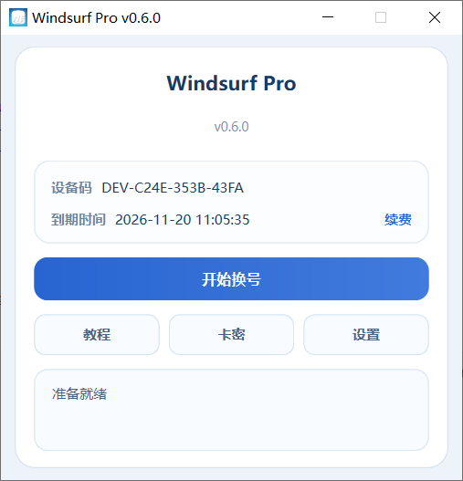

# Windsurf Pro

Windsurf Pro 是一款面向 Windows 平台的桌面客户端，支持无限重置，持续优化稳定性、兼容性与用户体验。

## 当前版本

- 版本：v0.6.1
- 平台：Windows
- 文件：Windsurf-Pro.exe

## 更新亮点

- 支持无限重置
- 优化核心流程与执行逻辑
- 改进本地状态处理与同步机制
- 优化交互反馈与操作体验
- 修复部分已知问题

## 下载说明

请在仓库 Release 页面下载最新版本 `Windsurf-Pro.exe`。

## 社区与更新

- GitHub：获取最新版发布包与更新说明
- Gitee：作为国内同步更新与下载渠道
- QQ 群：用于版本通知、使用交流与问题反馈

## 搜索关键词

Windsurf Pro、Windows 客户端、Windows 桌面客户端、桌面软件、无限重置、稳定体验、兼容性优化、高效工具、最新版下载

